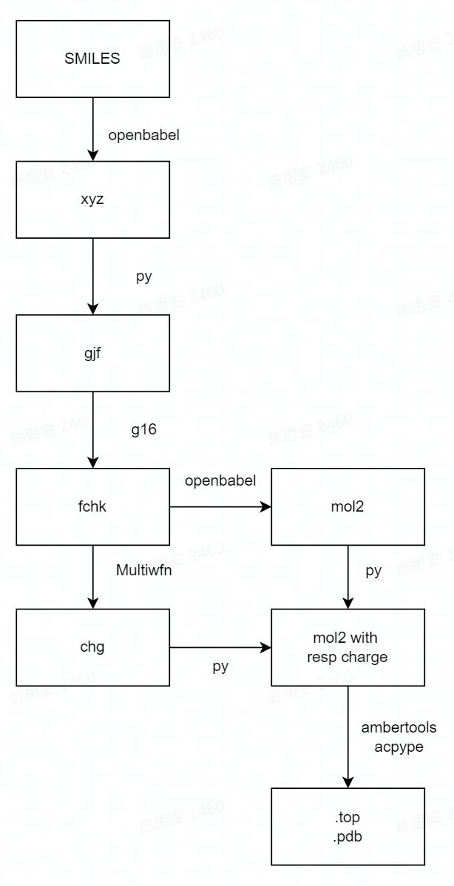

<a name="hLL2r"></a>
# 简介
本工作流基于dflow开发，旨在从SMILES字符串出发，使用dflow获取分子动力学模拟所需的完整力场(FF)文件。该工作流通过pythonOP方便地调用多种软件和python库，并通过切换executor快速实现多平台迁移。工作流全流程示意如下：
<a name="wfQUC"></a>
# 详情
<a name="93xcm"></a>
## 工作流

<a name="8rToP"></a>
## 步骤1 SMILE生成g16计算文件

可以看到1_gengjf目录中有如下文件：<br />1_gengjf/<br />├── electrolyte.json<br />├── ethane_to_compare.gjf<br />└── wf_gengjf.py

electrolyte.json中的"smi":["CC"],字段提供了所需要转换的SMILEs结构，此处以乙烷”CC”为例

将wf_gengjf.py中的excutor改为可用的机器，要求机器有openbabel依赖，运行命令
```
python wf_gengjf.py
```
最终示例文件将ethane.gjf下载回本地，该文件除坐标外的内容应与ethane_to_compare.gjf相似。


<a name="OUi1b"></a>
## 步骤2 DFT计算
该步骤中提交上一步生成的gjf，调用gaussian16进行DFT计算后传回.log文件与.fchk文件。<br />文件夹结构如下：<br />2_DFTcalc/<br />├── filesIO<br />│  └── DME_1.gjf<br />└── wf_DFT.py


将wf_DFT.py中的excutor改为可用的机器，要求机器有g16与formchk可执行文件，运行命令
```
python wf_DFT.py
```
执行完成后结果如下<br />├── filesIO<br />│   ├── DME_1.gjf<br />│   ├── out.fchk<br />│   └── out.log
<a name="4eYNE"></a>
## 步骤3 RESP拟合
该步骤实现从所计算的DFT优化几何与波函数，通过RESP拟合过程获取各原子的部分电荷。由于mol2文件可记录RESP电荷，故最终将优化几何与RESP电荷均写入一个mol2文件中，方便后续计算。<br />目录结构如下：<br />3_1_ESPcalc_genESP/<br />├── filesIO<br />│   ├── out.fchk<br />│   └── out.mol2<br />└── wf_calcRESP.py

同样，将wf_calcRESP.py中的excutor改为可用的机器，要求机器有Multiwfn以及openbabel，执行命令
```
python wf_calcRESP.py
```
该案例计算完成后，将out.mol2传回filesIO中，目录结构如下<br />3_1_ESPcalc_genESP/<br />├── filesIO<br />│   ├── out.fchk<br />│   └── out.mol2<br />└── wf_calcRESP.py

<a name="DywVl"></a>
## 步骤4 力场生成
该步骤实现从所计算的DFT优化几何与RESP拟合电荷（out.mol2）生成基于GAFF力场或OLPS-AA力场的拓扑文件。

目录结构如下：<br />3_2_acpype/<br />├── filesIO<br />│   └── out.mol2<br />└── wf_genFF.py

同样，将wf_genFF.py中的excutor改为可用的机器，要求机器有ambertools与acpype，执行命令
```
python wf_genFF.py
```
计算完成后，将所有文件传回。<br />3_2_acpype/<br />├── filesIO<br />│   ├── gen_FF.sh<br />│   ├── leap.in<br />│   ├── leap.log<br />│   ├── Lig.frcmod<br />│   ├── Lig.inpcrd<br />│   ├── Lig.mol2<br />│   ├── Lig.prmtop<br />│   ├── out.mol2<br />│   └── UNL.amb2gmx<br />│       ├── acpype.log<br />│       ├── em.mdp<br />│       ├── md.mdp<br />│       ├── posre_UNL.itp<br />│       ├── rungmx.sh<br />│       ├── UNL_GMX.gro<br />│       └── UNL_GMX.top<br />└── wf_genFF.py


